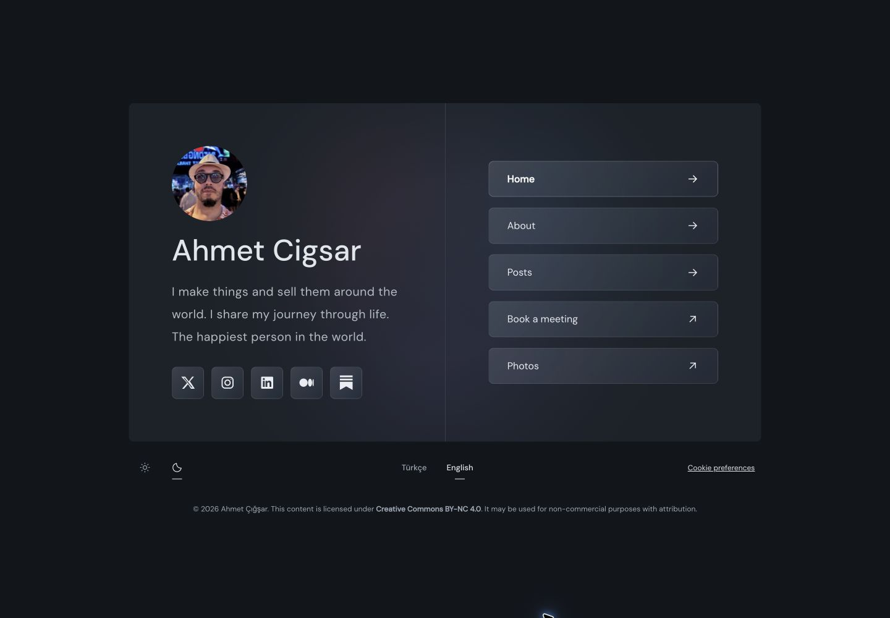
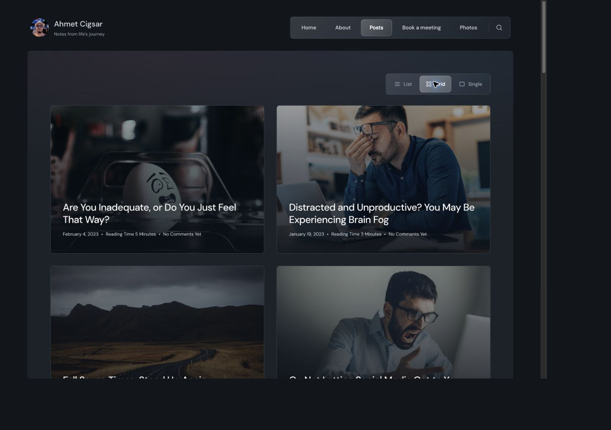
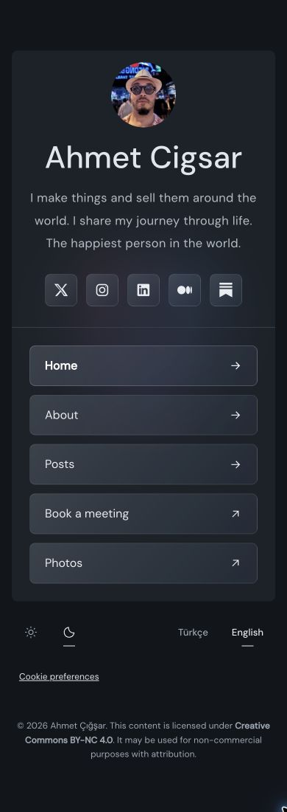

# Persona Bio

[](LICENSE)

A responsive personal profile and blog theme for [EmDash CMS](https://emdashcms.com/), built with Astro and configured for Cloudflare Workers.

[Download ZIP](https://github.com/ahmetcigsar/emdash-theme-persona-bio/archive/refs/heads/main.zip) · [Use this template](https://github.com/new?template_name=emdash-theme-persona-bio&template_owner=ahmetcigsar) · [Theme guide](docs/theme.md)

## Live screenshots

English screenshots from [ahmet.bio](https://ahmet.bio/en/), a live site using Persona Bio. These show the site's own content and customization; the starter includes generic sample content.

### Homepage — desktop



### Posts — desktop



### Mobile

| Homepage | Posts |
| --- | --- |
|  |  |

Captured from the live English pages in dark mode. Screenshots are showcase material; the theme code remains MIT-licensed. See [third-party notices](THIRD_PARTY_NOTICES.md) for screenshot content attribution.

## Features

- Two-column profile card with CMS-managed biography, photo, social icons, and navigation
- Blog archives with list and grid views, article pages, categories, tags, search, and RSS
- Light, dark, and system appearance modes with responsive navigation
- English by default; optional Turkish routes under `/tr/`
- EmDash editing, drafts, publishing, SEO, and preview integration
- Original sample content; no personal accounts, tracking IDs, or production credentials

## Start a new site

Use GitHub's **Use this template** button, download the ZIP, or run:

```bash
npm create astro@latest -- --template github:ahmetcigsar/emdash-theme-persona-bio
```

Inside your new project, use Node.js 22 and the pnpm version declared in `package.json`:

```bash
pnpm install
pnpm dev
```

Open `http://localhost:4321/_emdash/admin` and complete first-time setup. Local development uses local Cloudflare emulation; production resource IDs are not required for this step. On an empty database, EmDash applies the bundled seed. Include sample content to get the example profile, About page, and post; without samples, create and publish your own entries. Create the homepage profile with slug `personabio` in **Theme Profiles**. Restart the dev server after completing initial setup so EmDash regenerates collection types from the initialized schema.

```bash
pnpm typecheck
pnpm build
```

## Customize

- **Theme Profiles:** edit the `personabio` entry's name, biography, and photo.
- **Menus:** edit `primary` for navigation and `social` for social links.
- **Site settings:** change the site title and tagline.
- **Posts / Pages:** replace the sample writing with your own content.
- **Styles:** edit `src/styles/personabio.css`, `theme.css`, and `appearance.css`.
- **Favicon:** replace `public/favicon.svg`.

Documentation and developer-facing descriptions are in English. Turkish interface translations are optional runtime content, separate from documentation.

## Deploy to Cloudflare

1. Create your own D1 database and R2 bucket in Cloudflare.
2. Update `wrangler.jsonc`: set your Worker name, D1 name and ID, and R2 bucket name. The included all-zero database ID is a local-development placeholder.
3. Copy `.env.example` to `.env` and set `SITE_URL` to your public HTTPS origin. Provide the same variable in any build environment.
4. Authenticate Wrangler to your own Cloudflare account and run `pnpm deploy`.
5. Complete setup on the production site's `/_emdash/admin` route. Local development data is not copied into production automatically.

The included GitHub Actions workflow only validates the project. It does not deploy anything or require deployment secrets. Cloudflare's Astro adapter configures its image and session bindings during the build; review the generated deployment configuration for your account before deploying.

## Existing EmDash sites

This is a complete Astro template, not a ZIP that can be activated from the admin panel. For an existing site, merge the theme's layouts, components, styles, and routes into a separate branch, then add the `bio_profiles` collection and required menus without replacing your database, content, or deployment configuration. Seed files do not automatically migrate initialized databases.

The theme catalog entry is local to the site. This repository is not a public EmDash marketplace listing.

## Routes

| Page | Route |
| --- | --- |
| Profile | `/` |
| Posts | `/posts` |
| Post or page | `/:slug` |
| Category / tag | `/category/:slug`, `/tag/:slug` |
| Search | `/search` |
| RSS | `/rss.xml` |
| Static theme demo | `/themes/personabio/demo` |
| CMS content preview | `/themes/personabio/preview` |

Content routes also support the `/tr/` prefix. Pages take precedence if a post and a page use the same slug. Reserve built-in route names such as `posts`, `search`, `category`, `tag`, and `tr`.

## License

Persona Bio is distributed under the [MIT License](LICENSE).

You may use, modify, and redistribute the theme, including in commercial projects, under the terms of that license. Retain the copyright and permission notices when distributing copies or substantial portions of the software. The theme is provided without warranty.

Bundled sample text and SVG placeholders are covered by the same license. Dependencies and fonts retain their own licenses; see [third-party notices](THIRD_PARTY_NOTICES.md). Content you publish on your own site is not automatically licensed under MIT.
